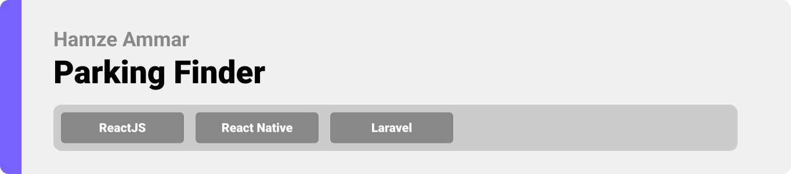
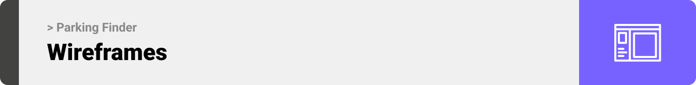

<div align="center">

> Hello world! This is the project’s summary that describes the project plain and simple, limited to the space available. 

> **[PROJECT PHILOSOPHY](https://github.com/Hamze-Ammar/Parking-Finder#project-philosophy) • [WIREFRAMES](https://github.com/Hamze-Ammar/Parking-Finder#wireframes) • [TECH STACK](https://github.com/Hamze-Ammar/Parking-Finder#tech-stack) • [IMPLEMENTATION](https://github.com/Hamze-Ammar/Parking-Finder#implementation) • [HOW TO RUN?](https://github.com/Hamze-Ammar/Parking-Finder#how-to-run)**

</div>

<br><br>


> Parking Finder app is a revolutionary solution to reinvent the parking experience. It is more than just another navigation app; it allows you to access your parking lot on the go using the pre-reservation feature among many others.
>
> Features include Google Maps-powered guidance to find a car park, as well as providing detailed, live information around hours and availability, directions and distance. While using a network of installed sensors we can allow access to each lot our sensors are installed in.

### User Stories

- As a user, I want to search fo the nearest parkings, so that I am aware of the distance and duration
- As a user, I want to display each parking, so that I can choose the one that have available spots
- As a user, I want to reserve a parking lot on the go, so that I can secure myself a spot
- As a user, I want to mark parkings as favorite, to find them faster
- As a user, I want to edit my profile and update my credentials
- As a user, I want to review previous searches and reservations, so that I can keep track of my experience and histories

### Owner Stories

- As an owner, I want to submit a form to become a partner, so that I can have my parking available on the platform

### Admin Stories

- As an admin, I want to review, accept, and decline requests sent from owners, so that I can ensure the best quality and experience for the users
- As an admin, I want to review analytics and statistics based on real time collected data, so that I can keep track of changes and updates
- As an admin, I want to have an overview picture about users experience, so that I can plan, take decisions based on data and statistics

<br><br>



> This design was planned before on paper, then moved to Figma app for the fine details.
> <br>
> | Login | Landing | Map Search |
> | ------- | ------- | ------- |
> |  |  |  |

> | Map Direction                                                                                         | Parking                                                                                                   | History                                                                                            |
> | ----------------------------------------------------------------------------------------------------- | --------------------------------------------------------------------------------------------------------- | -------------------------------------------------------------------------------------------------- |
> |  |  |  |

| Landing-Desktop                                                                                             | Admin-Parkings                                                                                         |
| ----------------------------------------------------------------------------------------------------------- | ------------------------------------------------------------------------------------------------------ |
|  |  |

| Admin-Overview                                                                                         |
| ------------------------------------------------------------------------------------------------------ |
|  |

<br><br>


Here's a brief high-level overview of the tech stack the Parking Finder app uses:

- Frontend: This project uses the [React Native framework](https://reactnative.dev/) for the mobile application along side with [ReactJS](https://reactjs.org/) for the desktop app. React (also known as React.js or ReactJS) is a free and open-source front-end JavaScript library for building user interfaces based on UI components. while React Native is used to develop applications for Android, Android TV, iOS, macOS, tvOS, Web, Windows and UWP by enabling developers to use the React framework along with native platform capabilities. For the development environment, Expo CLI was used.
- The backend is implemented using [Laravel](https://laravel.com/) which is a free and open-source PHP web framework, intended for the development of web applications following the model–view–controller (MVC) architectural pattern and based on Symfony.
- For persistent storage (database), the app uses [MySQL](https://www.mysql.com/). MySQL is a relational database management system based on SQL – Structured Query Language.
- For Hardware the app uses [Raspberry Pi 2](https://www.raspberrypi.com/products/raspberry-pi-2-model-b/) along side with [412 ARDUINO SENSOR IR DETECTOR](https://katgates.com/En/product_det/434693) to help implement the parking prototype built with this application.
- [React-native-maps](https://github.com/react-native-maps/react-native-maps) is used to display parkings on a map based on their locations.
- The app uses the font ["Montserrat"](https://fonts.google.com/specimen/Montserrat) as its main font, and the design of the app adheres to the material design guidelines.

<br><br>


> Using the above mentioned tech stacks and the wireframes built with Figma, the implementation of the app is shown as below, these are screen recordings from the real app

### Mobile App

> | Landing                                                                                              | Map Search                                                                                          | Map Dark Mode                                                                                           |
> | ---------------------------------------------------------------------------------------------------- | --------------------------------------------------------------------------------------------------- | ------------------------------------------------------------------------------------------------------- |
> |  |  |  |

> | Display Parking                                                                                              | Favorites Display                                                                                               | Favorites Delete                                                                                               |
> | ------------------------------------------------------------------------------------------------------------ | --------------------------------------------------------------------------------------------------------------- | -------------------------------------------------------------------------------------------------------------- |
> |  |  |  |

> | Reserve Parking                                                                                              | Profile                                                                                       | Upload Image                                                                                         |
> | ------------------------------------------------------------------------------------------------------------ | --------------------------------------------------------------------------------------------- | ---------------------------------------------------------------------------------------------------- |
> |  |  |  |

### Desktop App

| Landing Desktop                                                                                        | Become Partner                                                                                              |
| ------------------------------------------------------------------------------------------------------ | ----------------------------------------------------------------------------------------------------------- |
|  |  |

### Admin Panel

| Admin Overview                                                                                              | Admin Requests                                                                                              |
| ----------------------------------------------------------------------------------------------------------- | ----------------------------------------------------------------------------------------------------------- |
|  |  |

### Prototype

<!-- > | Gray Car | Pedestrian View | Side View | Tree | -->

> | -------------------------------------------------------------------------------------------------- | ----------------------------------------------------------------------------------------------------------- | --------------------------------------------------------------------------------------------------- | ------------------------------------------------------------------------------------------ |
> |  |  |  |  |

<br><br>


> To get a local copy up and running follow these simple steps.

### Prerequisites

- Download and Install [Node.js](https://nodejs.org/en/)
- npm
  ```sh
  npm install npm@latest -g
  ```
- Expo CLI
  ```sh
  npm install --global expo-cli
  ```
- Expo Go app for iOS and Android
  > 🤖 [Android Play Store](https://play.google.com/store/apps/details?id=host.exp.exponent) - Android Lollipop (5) and greater.  
  > 🍎 [iOS App Store](https://apps.apple.com/app/expo-go/id982107779) - iOS 11 and greater.

### Installation

1. Clone the repo

   ```sh
   git clone https://github.com/Hamze-Ammar/Parking-Finder.git
   ```

##### To Run The Mobile App

2. Navigate to the Frontend folder then ReactNative folder and install dependencies
   ```sh
   cd Parking-Finder/frontend/ReactNative
   npm install
   ```
3. Run the start up command
   ```sh
   npm start
   ```
4. Scan the generated QR code with your camera (ios) or through the Expo Go application (android)

##### To Run The Desktop App

5. Navigate to the Frontend folder then reactjs folder and install dependencies
   ```sh
   cd Parking-Finder/frontend/reactjs
   npm install
   ```
6. Run the start up command
   ```sh
   npm start
   ```
