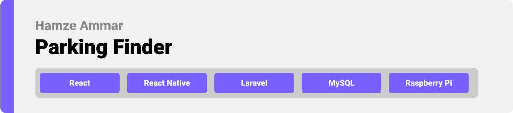
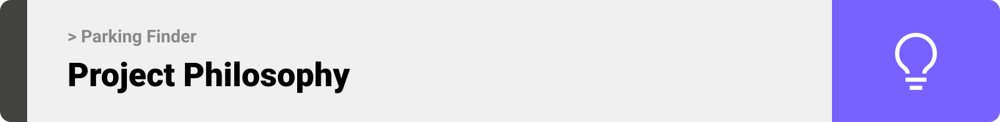
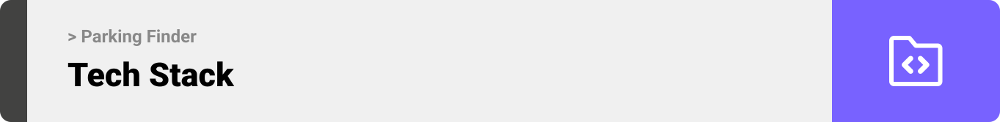
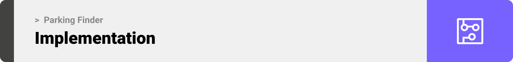

<div align="center">

> Hello world! This is the project’s summary that describes the project plain and simple, limited to the space available. 
 

> **[PROJECT PHILOSOPHY](https://github.com/julescript/well_app#-project-philosophy) • [WIREFRAMES](https://github.com/julescript/well_app#-wireframes) • [TECH STACK](https://github.com/julescript/well_app#-tech-stack) • [IMPLEMENTATION](https://github.com/julescript/well_app#-impplementation) • [HOW TO RUN?](https://github.com/julescript/well_app#-how-to-run)**

</div>

<br><br>



> Parking Finder app is a revolutionary solution to reinvent the parking experience. It is more than just another navigation app; it allows you to access your parking lot on the go using the pre-reservation feature among many others.
>
> Features include Google Maps-powered guidance to find a car park, as well as providing detailed, live information around hours and availability, directions and distance. While using a network of installed sensors we can allow access to each lot our sensors are installed in.

### User Stories

- As a user, I want to search fo the nearest parkings, so that I am aware of the distance and duration
- As a user, I want to display each parking, so that I can choose the one that have available spots
- As a user, I want to reserve a parking lot on the go, so that I can secure myself a spot

### Owner Stories

- As an owner, I want to submit a form to become a partner, so that I can have my parking available on the platform

### Admin Stories

- As an admin, I want to review, accept, and decline requests sent from owners, so that I can ensure the best quality and experience for the users
- As an admin, I want to review analytics and statistics based on real time collected data, so that I can keep track of changes and updates
- As an admin, I want to have an overview picture about users experience, so that I can plan, take decisions based on data and statistics

<br><br>


> This design was planned before on paper, then moved to Figma app for the fine details.
> <br>
> | Login | Landing | Map Search |
> | ------- | ------- | ------- |
> | ![Login]
 |  |  |

> | Map Direction                                                                                         | Parking                                                                                                   | History                                                                                            |
> | ----------------------------------------------------------------------------------------------------- | --------------------------------------------------------------------------------------------------------- | -------------------------------------------------------------------------------------------------- |
> |  |  |  |

| Landing-Desktop                                                                                             | Admin-Parkings                                                                                         |
| ----------------------------------------------------------------------------------------------------------- | ------------------------------------------------------------------------------------------------------ |
|  |  |

| Admin-Overview                                                                                         |
| ------------------------------------------------------------------------------------------------------ |
|  |

<br><br>



Here's a brief high-level overview of the tech stack the Well app uses:

- This project uses the [Flutter app development framework](https://flutter.dev/). Flutter is a cross-platform hybrid app development platform which allows us to use a single codebase for apps on mobile, desktop, and the web.
- For persistent storage (database), the app uses the [Hive](https://hivedb.dev/) package which allows the app to create a custom storage schema and save it to a local database.
- To send local push notifications, the app uses the [flutter_local_notifications](https://pub.dev/packages/flutter_local_notifications) package which supports Android, iOS, and macOS.
  - 🚨 Currently, notifications aren't working on macOS. This is a known issue that we are working to resolve!
- The app uses the font ["Work Sans"](https://fonts.google.com/specimen/Work+Sans) as its main font, and the design of the app adheres to the material design guidelines.

<br><br>


> Using the above mentioned tech stacks and the wireframes built with Figma, the implementation of the app is shown as below, these are screen recordings from the real app
> | Landing | Search | Reserve Parking |
> | ------- | ------- | ------- |
> |  |  |

<br><br>


> This is an example of how you may give instructions on setting up your project locally.
> To get a local copy up and running follow these simple example steps.

### Prerequisites

This is an example of how to list things you need to use the software and how to install them.

- npm
  ```sh
  npm install npm@latest -g
  ```

### Installation

_Below is an example of how you can instruct your audience on installing and setting up your app. This template doesn't rely on any external dependencies or services._

1. Get a free API Key at [https://example.com](https://example.com)
2. Clone the repo
   ```sh
   git clone https://github.com/your_username_/Project-Name.git
   ```
3. Install NPM packages
   ```sh
   npm install
   ```
4. Enter your API in `config.js`
   ```js
   const API_KEY = "ENTER YOUR API";
   ```
